# DARK CHOCOLATE FOR EVER

This is my th project for my Diploma in Software Dev Course and it’s been built for educational purposes only. 

The purpose of the e-commerce website is to sell dark chocolate to chocolate lovers offering them a various flavours of dark chocolate, some of them very unusual or exotic. 

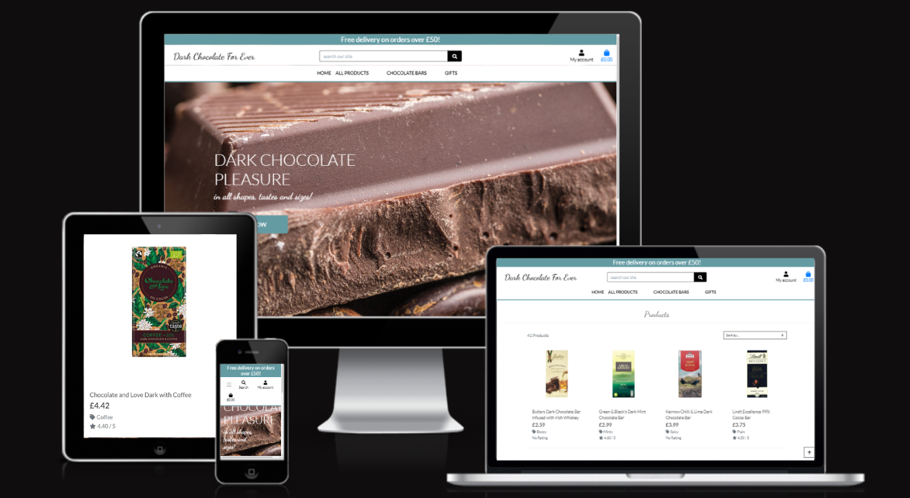

## Showcase

A deployed link to the website can be found [here](https://dark-chocolate-for-ever.herokuapp.com/)

To test payments you can use the following test details:

Card no: 4242 4242 4242 4242
Expiry date: 04/24
CSV: 242
ZIP: 42424

------
## Table of Contents
1. Business

2. UX
Project Goals
User Stories
Design

3. Features
Existing Features:
	- Products App
	- Home App
	- Bag App
	- Checkout App
    - Reviews App
    - Newsletter App
    - Profiles App
- Base Template
Features to be implemented

4. Database Structure
5. CRUD Operations and Defensive Design
6. Technologies Used:
    - Languages
    - Libraries and Packages
    - Tools
    - Databases
7. Testing:
    - Automated Testing:
    - Manual Testing: Feature Testing, Stripe Payment Testing, Responsivness

8. Deployment:
 - Heroku Deployment (incl AWS) 
 - Local Deployment

9. Marketing and SEO:
 - SEO: Keywords used:
 - FB page
 - Newsletter signup

10. Credits:
 - Content
 - Code 
 - Images and Media 
 - Acknowledgements

------
## 1. Business

### Business Model

My e-commerce website follows a Business to Consumer business model (B2C) which means that when consumers go online to search for dark chocolate and they find my website, they can browse through my store. When they find products they would like to purchase, they will place an order: place items into the shopping bag, add their payment details and pay for their purchase. Once order has been placed they will receive an order confirmation, and their order would be processed and despatched. Once the consumer would receive their goods, they would have an option to log in and rate the products received and leave a review if they wish. 

## 2. UX

### Project Goals

#### Target Audience
- Chocolate lovers, specifically people who enjoy eating dark chocolate
- Chocolate lovers with specific dietary needs like vegan, paleo, gluten-free, sugar-free, dairy-free
- People who would like to buy sweet and healthier gifts for their loved ones who love dark chocolate and/ or have a special dietary requirements like vegan, paleo, gluten-free, sugar-free, dairy-free

### User Goals / Site Visitor’s Goals
- Familiariaze themselves with a wide range of dark chocolate products available on the UK market by browsing this online shop and reading reviews
- Purchase products in a hassle-free, fast and secure way

### Site Owner’s Goals
- Establish a trusted brand and recognizable brand voice
- Provide their target audience with a safe e-commerce that enables them a hassle free 1st class customer experience
- Collect payments for their products and shipping services

### User Stories

**Viewing and Navigation**

1. As a Shopper I can view a list of products so that I can select some to purchase
2. As a Shopper I can view a specific category of products so that I can quickly find products I’m interested in without having to search through all products
3. As a Shopper I can view individual product details so that I can identify the price, description, product rating, product image and product size/weight
4. As a Shopper I can identify deals, clearance items and special offers so that I can take advantage of special savings on products I'd like to purchase
5. As a Shopper I can easily view the total of my purchases at any time so that I can avoid spending too much

**Registration and User Accounts**

6. As a Site User I can easily register for an account so that I can have a personal account and be able to view my profile
7. As a Site User I can easily login and logout so that I can access my personal account information
8. As a Site User I can easily recover my password in case I forget it so that I can recover access to my account
9. As a Site User I can receive an email confirmation after registering so that I can verify that my account registration was successful
10. As a Site User I can have a personalized user profile so that I can view my personal order history and order confirmations, and save my payment information

**Sorting and Searching**

11. As a Shopper I can sort the list of available products so that I can easily identify the best rated, best priced and categorically sorted products
12. As a Shopper I can sort a specific category of product so that I can find the best-priced or best-rated product in a specific category, or sort the products in that category by name
13. As a Shopper I can sort multiple categories of products simultaneously so that I can find the best-priced or best-rated products across broad categories, as as "chocolate bars" or "chocolate truffles"
14. As a Shopper I can search for a product by name or description so that I can find a specific product I'd like to purchase
15. As a Shopper I can easily see what I've searched for and the number of results so that I can quickly decide whether the product I want is available

**Purchasing and Checkout**

16. As a Shopper I can easily select the quantity of a product when purchasing it so that I can ensure that I don't accidentally select the wrong product and quantity
17. As a Shopper I can view items in my bag so that I can identify the total cost of my purchase and all items I will receive
18. As a Shopper I can adjust the quantity of individual items in my bag so that I can easily make changes to my purchase before checkout
19. As a Shopper I can easily enter my payment information so that I can check out quickly and with no hassles
20. As a Shopper I can feel my personal and payment information is safe and secure so that I can confidently provide the needed informatio to make a purchase
21. As a Shopper I can view an order confirmation after check out so that I can verify that I haven’t made any mistakes
22. As a Shopper I can receive an email confirmation after checking out so that I can keep the confirmation of what I’ve purchased for my records

**Admin and Store Management**

23. As a Store Owner I can add a product so that I can add new items to my store
24. As a Store Owner I can edit/ update a product so that I can change product prices, descriptions, images, and other product criteria
25. As a Store Owner I can delete a product so that I can remove items that are no longer on sale 

**Rating and Reviewing Product**

26. As a Customer I can click on a product I previously purchased so that I can give it a rating
27. As a Customer I can click on a product I previously purchased so that I can write a review about it

**Getting in Touch and Staying in Touch**

28. As a Shopper I can subscribe to a newsletter so that I can stay updated on the latest product news, discounts, etc. 
29. As a Shopper, I can contact the Seller via their Contact form so that I can ask any question I may have

### Agile Methodologies

During the project planning stage and development agile methodology was used. [User stories](https://github.com/psnaz/dark-chocolate-for-ever/issues) and [project](https://github.com/users/psnaz/projects/5) were created in Github. During the development I was using mainly the kanban style project board in Github - see the screenshot below.

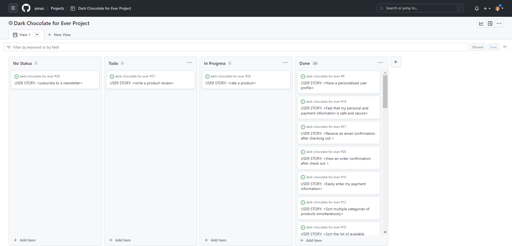

------

### Design

#### Wireframes created with Canva:

[Desktop wireframes](https://www.canva.com/design/DAFl_GX_YAI/dZePMTanzrQNdMuHsd9x4g/edit?utm_content=DAFl_GX_YAI&utm_campaign=designshare&utm_medium=link2&utm_source=sharebutton)

[Mobile wireframes](https://www.canva.com/design/DAFmYcu3u3g/WXY7Od1bhDdMvEHF2VatBQ/edit?utm_content=DAFmYcu3u3g&utm_campaign=designshare&utm_medium=link2&utm_source=sharebutton)

#### Brand Colours / Colour Palette

- Colour palette created in canva.com, however, different colours used in the end

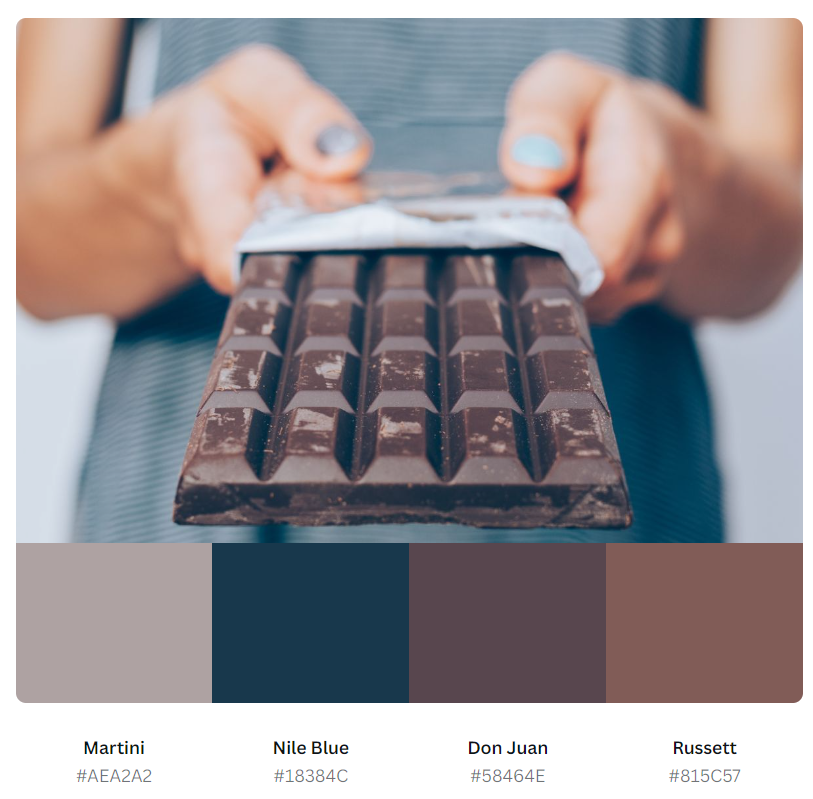

- Colours used as Brand Colours:
    - black: #000000
    - white: #FFFFFF
    - blue: #649ba3
    - dark brown: #527138

#### Typography

‘Lato’ used as a main font and 'Dancing Script' used as 'logo font'.

--- 

## 3. FEATURES

## Scope

To achieve the above project goals I have implemented the following features:

## Features

Dark Chocolate for Ever is an e-commerce store that includes several pages: Home (with access to the store through a shop now button), All Products page (shop), Product detail page, Chocolate Bars pages for individual categories (Plain, Nutty Fruity, Boozey, Spicy, Minty, Caramel, All), Gift Vouchers page, Gift Hampers Page, Subscribtions page, Registration Page, Login Page, Logout page, About page, Contact page and Terms and Conditions page.

### HOME page

Includes Navigation Bar, enticing Hero Image with a blue Shop Now button, Welcome section and Footer.

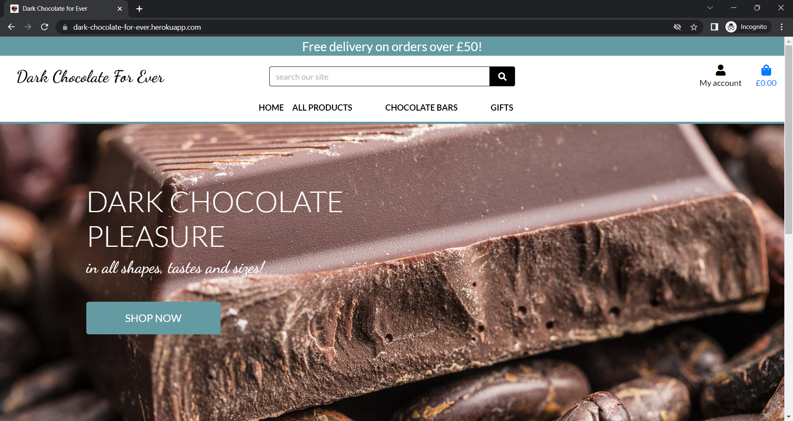

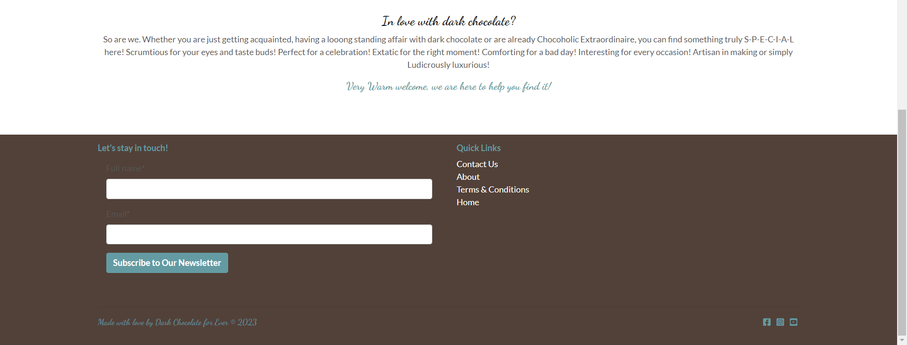

### NAVIGATION Bar

The responsive navigation bar is available throught the site and includes a logo links to dropdown menus named Home, All Products, Chocolate Bars, Gifts. There are also an account icon with access to Registration and Login pages and Shopping back icon with access to the shopping bag present.

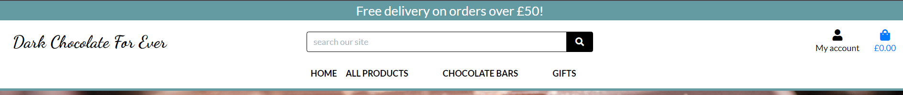

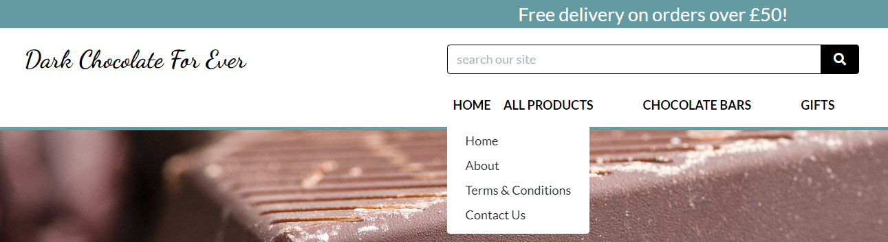

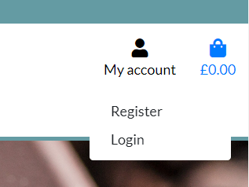

On medium to small size devices the navigation bar with dropdowns changes into a hamburger menu.

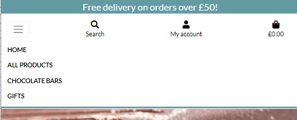

The blue delivery banner at the very top of the home page is a part of the navbar and informs shoppers about the current delivery offer (Free delivery for orders over £50). This is not clickable and servers marketing purposes only.

### HOME Dropdown

#### *About Page*

Page accessible through Home Dropdown and dedicated to Our Mission statement.

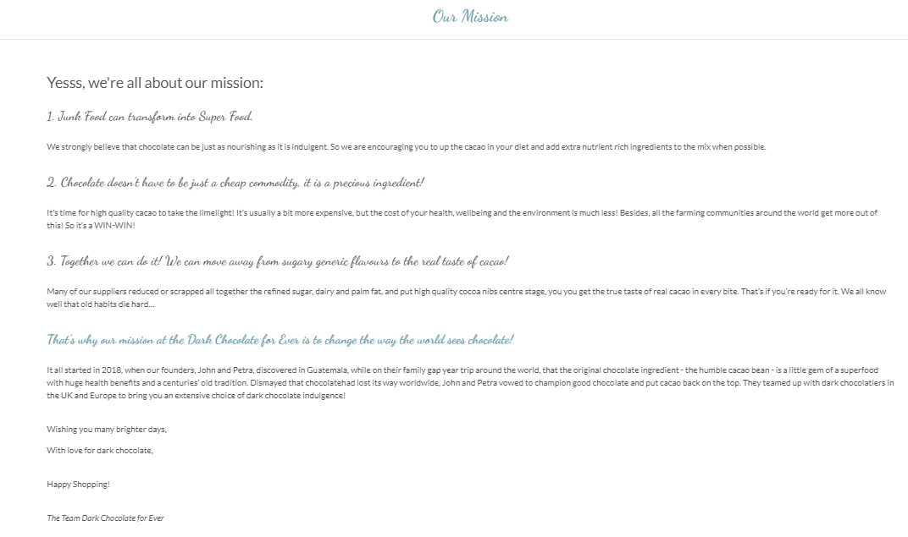

#### *Terms & Conditions Page*

Page accessible through Home Dropdown and dedicated to the Terms and Conditions incl. Shipping Policy and Delivery Information and also Summer Shipping Policy.

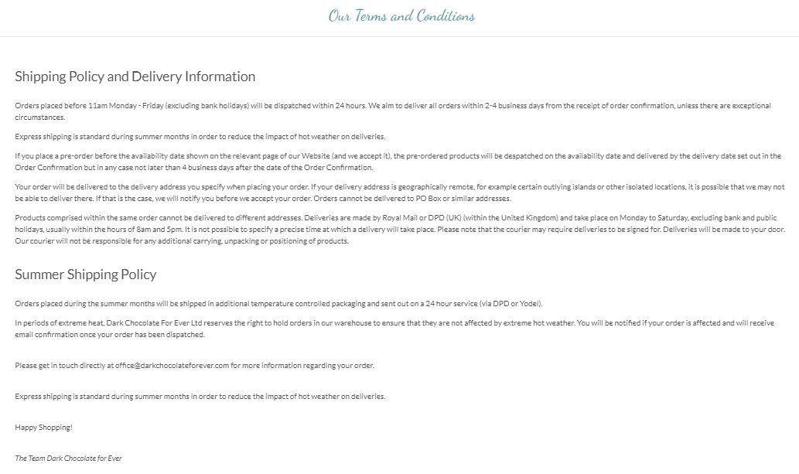

#### *Contact Us Page*

Page accessible through Home Dropdown and dedicated to a Contact form and a message how quickly the business responds.

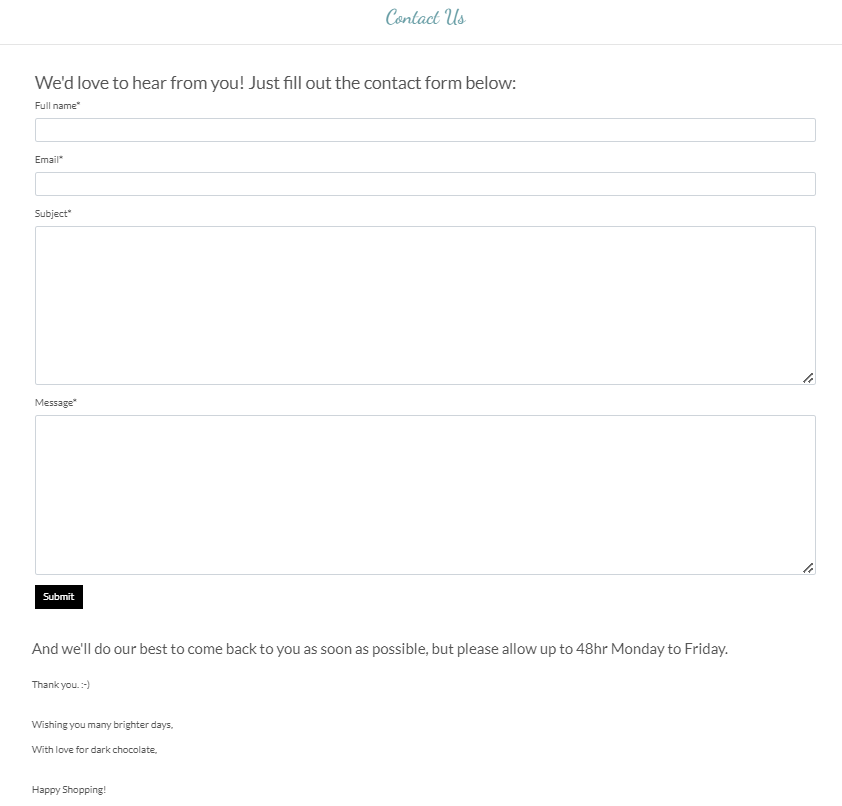

**NOTE: Access to the About, Terms & Conditions and Contact Us pages are is also available through the Quick Links in the footer at the bottom of the page.**

### ALL PRODUCTS Dropdown

#### *Products Page*
Page accessible through All Products Dropdown menu. Sort by functionality available, so that the products can be sort out by Price, Rating, Name or Category. 

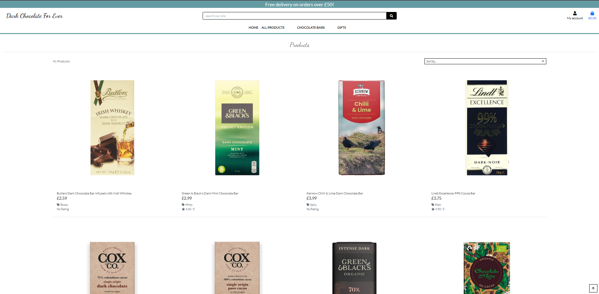

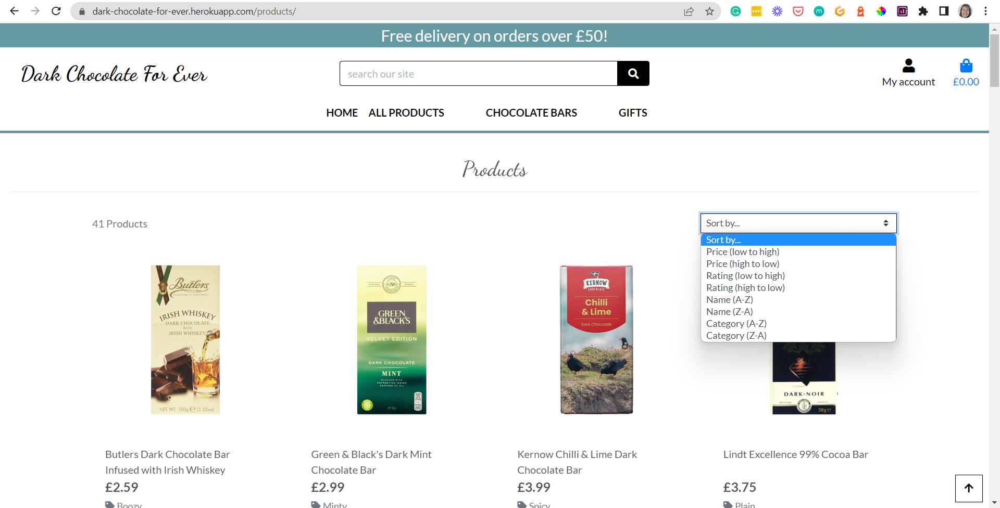

There are variations of this page also available directly  through the All Products Dropdown that will display the products sorted by Price, Rating and Category.

#### *Product Details Page*

Product Details Page is accessible when clicked on each individual product displaying the product image, product name, price, size/ weight, cocoa content, category, rating, product description, 

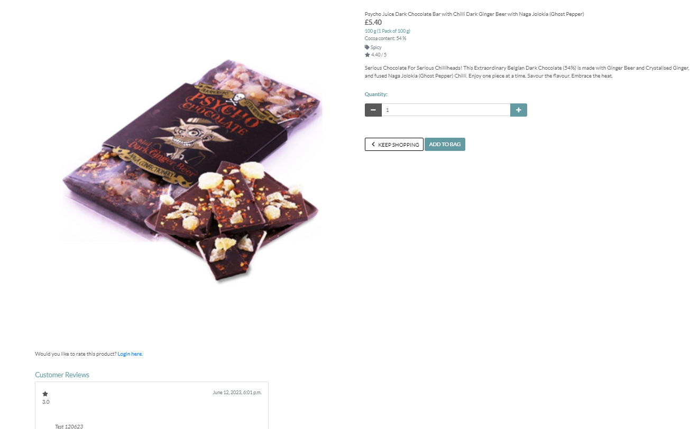

### GIFTS Dropdown

#### *Gift Hampers*
Page accessible through Gifts Dropdown and dedicated to Gift Hampers Offer with a message when offer will be available in the future.

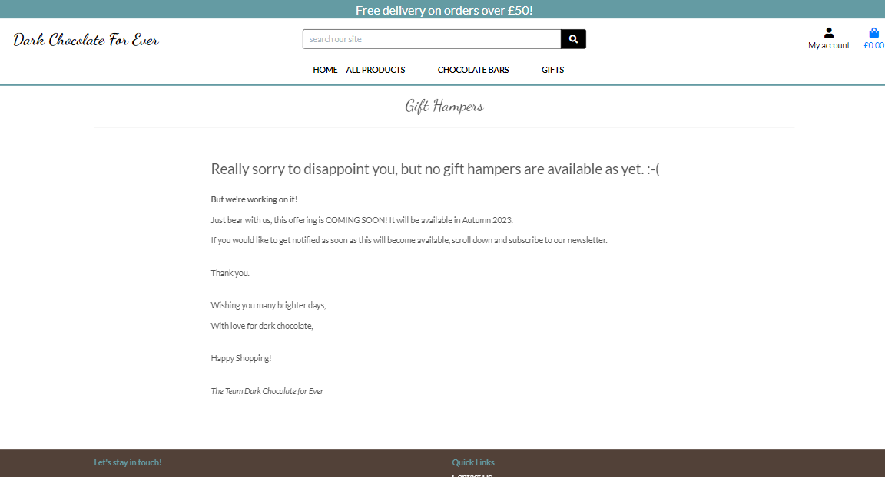

#### *Gift Vouchers*
Page accessible through Gifts Dropdown and dedicated to Gift Vouchers Offer with a message when offer will be available in the future.

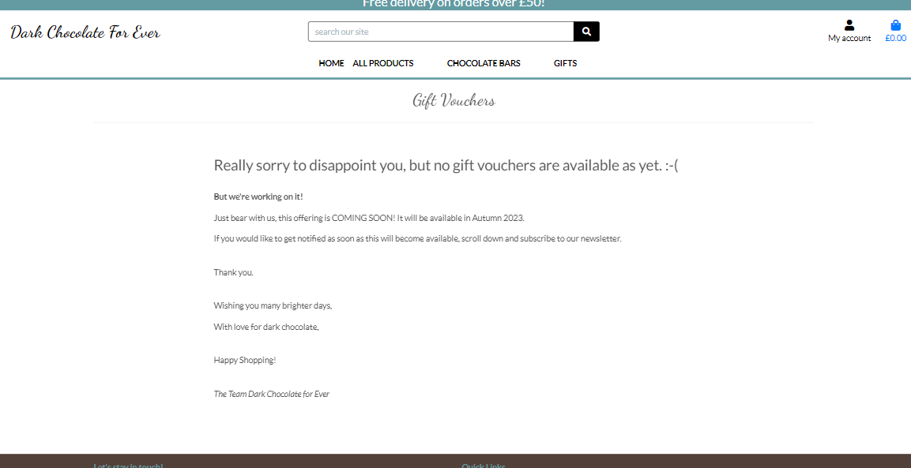

#### *Subscriptions*
Page accessible through Gifts Dropdown and dedicated to Subscriptions Offer with a message when offer will be available in the future.

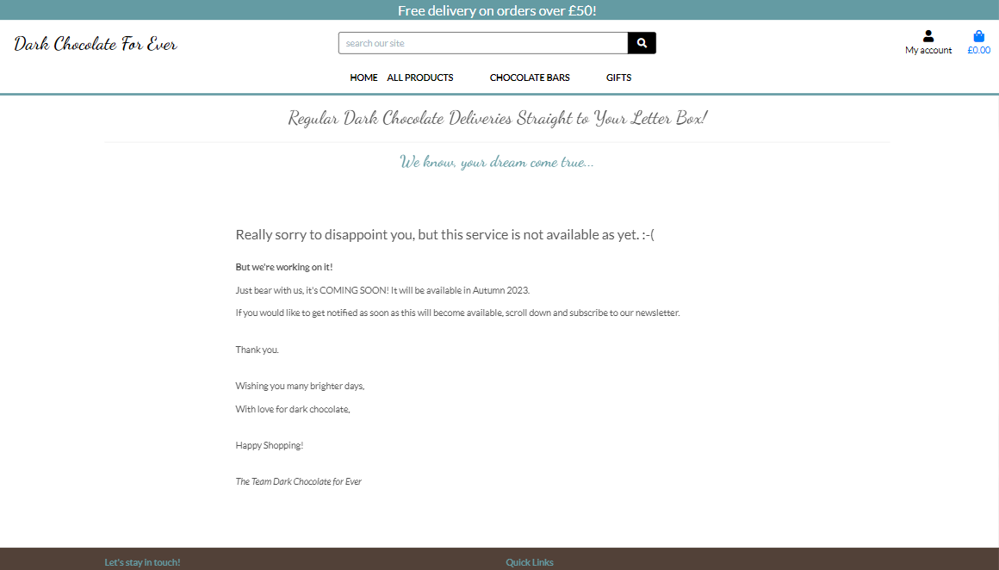

### FOOTER
The Footer is available throughout the site and includes the following features: Newsletter Sign Up form witha  blue Subscribe to Our Newsletter button, Quick Links (Contact Us, About, Terms & Conditions, Home), Copyright Credentials and Social Media Icons (Facebook - connected to Dark Chocolate for Ever Business page, Instagram and Youtube).

---

## 4. DATABASE STRUCTURE

I have used a relational database for this project. SQLite/Postgress was used as the main database, all data migrated to Heroku and then due to the recent Heroku changes it was successfully migrated to ElephantSQL.

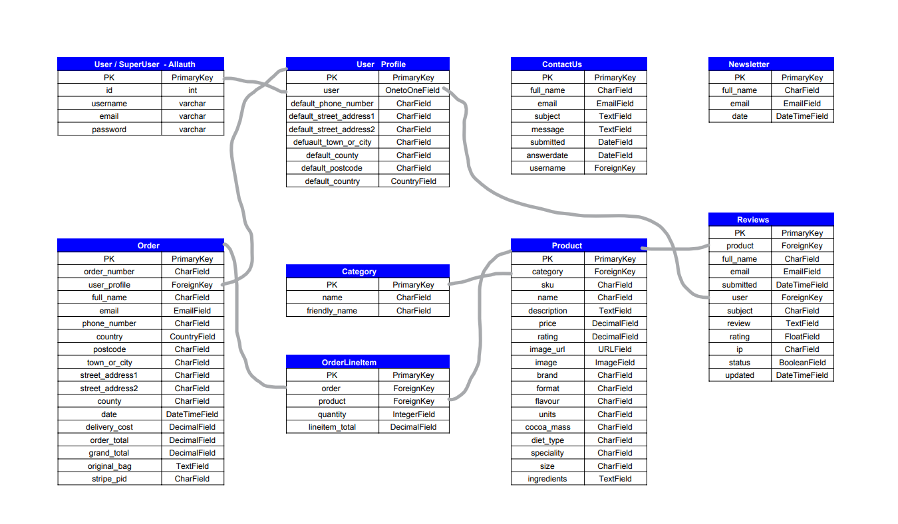

I have created the following separate apps and inclueded my custom models:

- Contact app / ContacUs model
- Reviews app / ProductReview model
- Newsletter app/ Newsletter model

---

## 5. CRUD OPERATIONS AND DEFENSIVE DESIGN

---

## 6. TECHNOLOGIES USED

### Languages Used
- HTML5, Boostrap framework
- CSS3
- JavaScript
- Python, Django library
- SQLLite/Postgress

### Frameworks, Libraries and Programs Used

- Canva.com: Canva Color Palette Generator was used to create a color palette and Canva was used to create a mock-up design, and for resizing and editing images.
- Git: Git was used for version control by utilizing the Gitpod terminal - to commit to Git and push to GitHub
- GitHub: Github is used to store the project's code after being pushed from Git.
- GoogleDev Tools used to see the element positioning and responsiveness
- [Google Fonts](https://fonts.google.com/): Google fonts ‘Lato’ and 'Dancing Script' were used. 
- favicon.io was used to create the favicon
- FontAwesome used for social media icons: FB, IG, YT

- [amiresponsive](http://ami.responsivedesign.is/) was used to create the mockup for Readme
- Validation services: W3C Markup Validation, W3C CSS Validation, PEP8 Validation

---

## 7. TESTING

I have tested this project manually and completed also some auto testing via the online validation services. See the full details on a separate page [HERE.](https: add THE TESTING.md FILE LINK HERE!!)

---

## 8. DEPLOYMENT

### CREATING A DJANGO APP

The following steps had to be taken to create the Django app:

1. Go to Github and
2. Create a new repository using the CI template
3. Create a workspace  by clicking the green Gitpod button in your new repository page
4. Carry out an initial commit
5. Install Django and gunicorn: `pip3 install django gunicorn`
6. Install any supporting libraries: `pip3 install dj_database_url_psycopg2`
7. Create requirements.txt file: `pip3 freeze --local > requirements.txt`
8. Create Django project: `django-admin startproeject yourprojectname`
9. Create an app within the project: `python3 manage.py startapp yourappname `
10. Add your created app to the list of installed apps in settings.py 
11. Make migrations: `python3 manage.py makemigrations`
12. Migrate your changes: `python3 manage.py migrate`
13. Test by running your server locally: `python3 manage.py runserver`
14. Create procfile: `python3 run.py > Procfile`
15. Push your changes to Github: 
    `git add .`
    `git commit -m “Commit message here”`
    `git push`

Once this is done, you can start deployment to Heroku

### Deployment to Heroku

This site was deployed to Heroku pages by taking the following steps:

Go to Heroku and
1. Create Heroku account, log in and go to the Dashboard
2. Click `“NEW”`
3. Click `“CREATE NEW APP”`
4. Give your app a name and select the region closest to you (eg. Europe). Click `“CREATE APP”` to confirm
As the database provided by Django is not suitable for a production enviroment, you have to create a new database in ElephantSQL.com and transfer the data from your IDE to your new database. 
5. Create ElephantSQL account, log in and go to your dashboard.
6. Click `“CREATE NEW INSTANCE”`
7. Set up your plan: Give it a NAME (usually the name of your project), select the free Plan (called Tiny Turtle), leave the tags blank
8. Click `“SELECT REGION”`
9. Select your closest data centre from the dropdown menu
10. Click `“REVIEW”`
11. Check if your details are correct and click `“CREATE INSTANCE”`
12. Return to the ElephantSQL dashboard and click on your database instance name.
13. In the URL section, click the copy icon to copy your new database URL
Go to your project workspace (eg. Gitpod) and
14. create `env.py`. Remember to include this file in `.gitignore` file as env.py mustn’t be included in your Github repository.
15. In your env.py file add the following code: `import os`   
16. You need to set environment variables: 
 First add a blank line, then set a DATABASE_URL variable with the value copied from ElephantSQL (step 13.) Your code should look like this: `os.environ[“DATABASE_URL”]=”<your copied string from ElephantSQL>”`   
17. To encrypt session cookies in Django application, you have to set up your SECRET_KEY in the env.py which can be anything. Your code should look like this: `os.environ[“SECRET_KEY”]=”wh@t_ever_you_made+up-comes!here”`
18. Save the env.py file
19. To make your Django project aware of the env.py file, open your settings.py and add the following code below your Path import: 
 `import os`
 `import dj_database_url`
 `if os.path.isfile(‘env.py’)`
20. Further down, remove the insecure secret key provided by Django and change your SECRET_KEY variable to:
 `SECRET_KEY = os.environ.get(‘SECRET_KEY’)`
21. To hook up your database, scroll down in your settings.py file to the database section.
22. Comment out the original DATABASES variable and add the code below:
 `DATABASES = {‘default’: dj_database_url.parse(os.environ.get(“DATABASE_URL”))}`
23. Save your settings.py. Your app will now be connected to your remote database hosted on ElephantSQL
24. Migrate these changes: `python3 manage.py migrate`
Once migrated go over to your ElephantSQL account and
25. select your database instance and select the `“BROWSER”` on the left.
26. Click `“TABLE QUERIES”` to see a dropdown list and your database structure. SQL Query list must have populated from your Django migrations.
Head back to your Gitpod workspace and
27. Add, commit and push your project to GitHub again. Your Gitpod workspace is now connected to your ElephantSQL database.
Now you have to connect your new ElephantSQL database to Heroku, so head back to your Heroku dashboard and
28. Click on the Settings tab
29. Set the following config vars: 
`DATABASE_URL` and add the URL of your ElephantSQL database as a value, 
`CLOUDINARY_URL` and add the URL of your Cloudinary acc (if you are using Cloudinary for storage of images),
`SECRET_KEY` that contains your secret key, and 
`PORT` with a value of 8000, also
`DEBUG` and add True as a value, 
`DISABLE_COLLECTSTATIC` and add 1 as a value.
In the Gitpod workspace update your settings.py:
30. Set DEBUG to True
In Heroku account 
31. click the `Deploy tab` and as deployment method select `Github` and click the `connect to Github`
32. Search for your repository name, once found, `connect`.
33. Scroll down to `Manual deploy` and click `‘Deploy branch’`. Your app will be built.

Once your ‘App was successfully deployed’ message appears and button with your deployed link, you can click on it to see your app.

### AWS S3 Bucket Configuration ???
- Create an account on Amazon AWS

## Forking the GitHub Repository OR Making a Local Clone

If you are interested how to fork this repository or how to make a local clone, this information can be found in Github documentation [here](https://docs.github.com/en/repositories/creating-and-managing-repositories/cloning-a-repository).

---

## 9. Marketing and SEO

### Marketing

As this business has currently no marketing budget for paid advertising, it relies purely on the two following unpaid marketing strategies:

**Social Media Presence**
posting on Facebook - the Facebook page can be found [here](https://www.facebook.com/DarkChocolateForEver/)

See screenshots below:
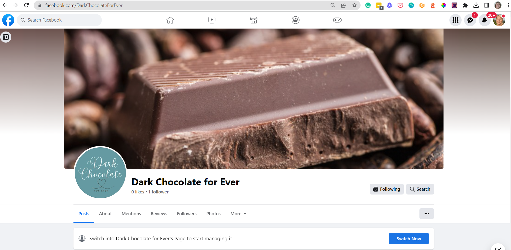

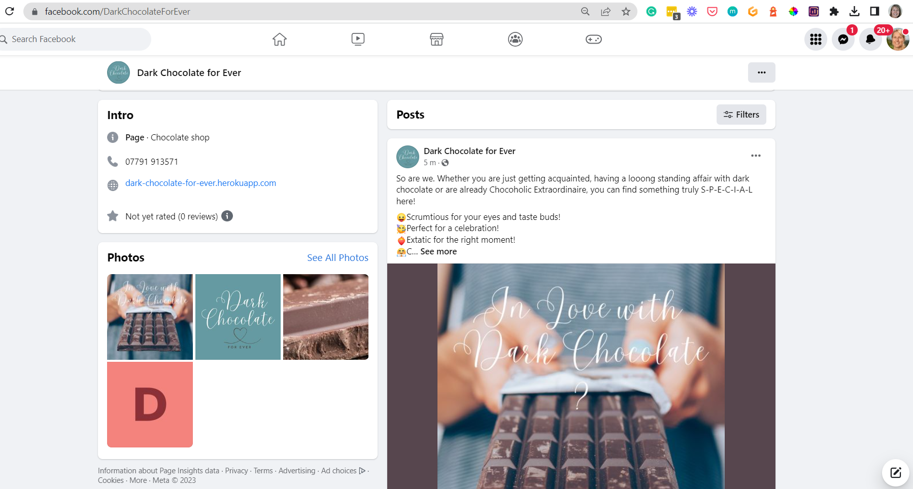

**Email Marketing Strategy**
enabled by signing up to a newsletter via a Newsletter signup form.

### SEO

Keyword Serch carried out on Semrush:

---

## 10. Credits

### Code

- The majority of the code came from the Django Walkthrough projects (Boutique Ado and Blog) and the Diploma in Software Development study materials, my notes taken during going through the materials and by working with Google DevTools - trial and error approach.

- Additonal knowledge used from the following courses: 
  - [The Boostrap 4 Camp](https://www.udemy.com/course/bootstrap-4-bootcamp/)
  - for Reviews functionality: [Python Django Ecommerce | Advanced Django Web App From Basic ](https://www.udemy.com/course/django-ecommerce-project-based-course-python-django-web-development/)

- [MDN Web Docs](https://developer.mozilla.org/en-US/): Used extensively to deepen my knowledge and understanding of HTML and CSS, and chek for ideas and solutions, specifically:  

- For Contact form/ Query model: Youtube [Django Tutorial #9: A More Complex Form (2022) by Django tutorials](https://www.youtube.com/watch?v=-qAf_Qx6Ygg)

- [Djangoproject documentation](https://docs.djangoproject.com/en/4.1/)

- [Bootstrap documentation](https://getbootstrap.com/docs/4.6/getting-started/introduction/)

- Stackoverflow

- For 404 and 500 Error pages [this youtube tutorial](https://www.youtube.com/watch?v=zSEexM0GspU) and [this article](https://freefrontend.com/html-funny-404-pages/)

-  Mentor’s advice

### Content

- Product descriptions were taken from [Amazon UK](https://www.amazon.co.uk/) and amended by the developer
- About page/ Mission was inspired by Ombar Store on [Amazon UK](https://www.amazon.co.uk/)
- Terms and conditions were taken and amended from [Hukitchen](https://hukitchen.co.uk/policies/shipping-policy) 

### Media

- Hero image taken by [XXX](https://unsplash.com/photos/Wu7hYE7Lzzs)  
 downloaded from unspleash.com

### Acknowledgements

- My family
- My Mentors Guido Cecilio and Chris Quinn for their patience and great insights.
- Tutor support at Code Institute for their support.

- Code Institute Slack Community for all their advice and support.

------
