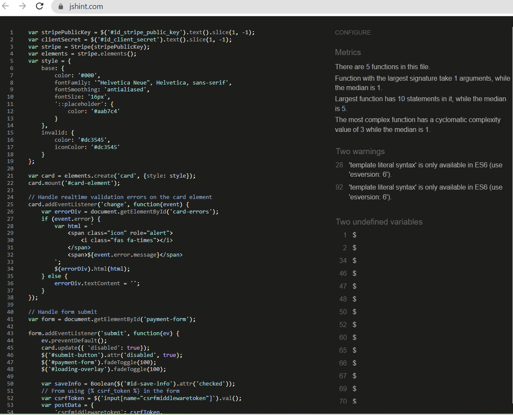
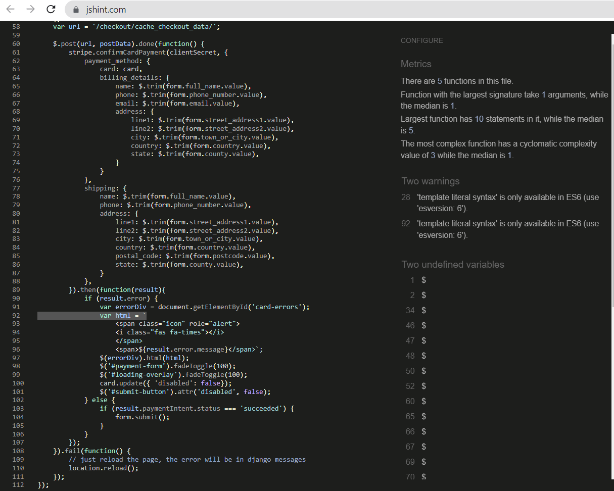
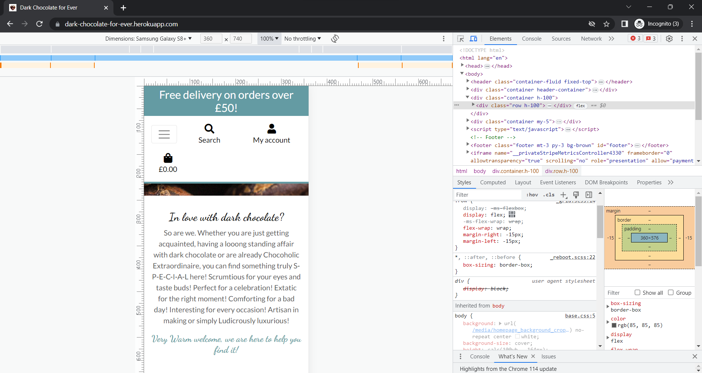
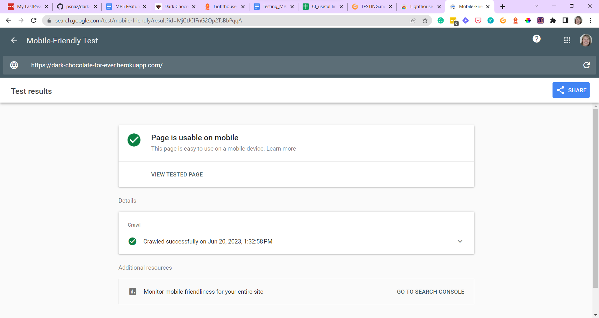

# TESTING

## Code Validation
The below online validation tools were used to validate the project pages to ensure that there were no syntax errors in the project.

### HTML Validator
See the screenshot below for HTML code test results run with [HTML Validator.](https://validator.w3.org/) No errors detected.

### CSS Validator

See the screenshot below for CSS code test results run with [CSS Validator.](https://jigsaw.w3.org/css-validator/) No errors detected.

### JavaScript Validator

See the screenshot below for JavaScript code test results run with [JavaScript Validator.](https://jshint.com/)

### Python Linter

Majority of errors discovered removed when coding and before running the Python Linter test already in the Gitpod workspace.
The following pages have been tested on [Python Linter.](https://pep8ci.herokuapp.com/):

**Bag** (app)

Templatetags >
-bagtools.py - no errors found

- admin.py - no errors found
- apps.py - no errors found
- contexts.py - no errors found
- models.py - no errors found
- urls.py - no errors found
- views.py - no errors found

**Checkout** (app)
- admin.py - no errors found
- apps.py - no errors found
- forms.py - no errors found
- models.py - 1 error found: 119: E501 line too long (95>79 characters)
- signals.py - no errors found
- urls.py - no errors found
- views.py - no errors found
- webhook-handler.py - no errors found
- webhooks.py

**Contact** app
- admin.py - no errors found
- apps.py - no errors found
- forms.py - no errors found
- models.py - no errors found
- urls.py - no errors found
- views.py - no errors found

**Dark_chocolate_for_ever** app
- asgi.py - no errors found
- settings.py - 147: E501 line too long (91>79 characters),  145: E501 line too long (81>79 characters),  153: E501 line too long (82>79 characters),  156: E501 line too long (83>79 characters)
- urls.py - no errors found
- views.py - no errors found
- wsgi.py - 14: E501 line too long (83>79 characters)

**Home** app
- admin.py - no errors found
- apps.py - no errors found
- models.py - no errors found
- urls.py - no errors found
- views.py - no errors found

 **Newsletter** app
- admin.py - no errors found
- apps.py - no errors found
- contexts.py - no errors found
- forms.py - no errors found
- models.py - no errors found
- urls.py - no errors found
- views.py - no errors found

**Products** app

- admin.py - no errors found
- apps.py - no errors found
- models.py - no errors found
- urls.py - no errors found
- views.py - 53: E501 line too long (80>79 characters)
- widgets.py - 9: E501 line too long (87>79 characters)

**Profiles** app
- admin.py - no errors found
- apps.py - no errors found
- forms.py - no errors found
- models.py - no errors found
- urls.py - no errors found
- views.py - no errors found

**Reviews** app
- admin.py - no errors found
- apps.py - no errors found
- forms.py - no errors found
- models.py - no errors found
- urls.py - no errors found
- views.py - no errors found

- manage.py - no errors found

---

## Lighthouse and GT Metrix Test

See the screenshot below for the Lighthouse test results run with [Lighthouse Chrome Extension.](https://chrome.google.com/webstore/detail/lighthouse/blipmdconlkpinefehnmjammfjpmpbjk) When tested for Performance, Accessibility, Best Practices and SEO, average results were achieved.

Additional tests carried out on [GT Metrix](https://gtmetrix.com/) (Website Performance Testing and Monitoring Online Tool). GT Metrix scanned all website pages during tests carried out from London based server. Although GT Metrix uses Lighthouse, the test results achieved were much better - please see the reports attached:

- [Desktop results](./docs/gtmetrix-report-desktop.pdf)
- [Mobile device results](./docs/gtmetrix-report-mobile.pdf)

---

## Responsiveness Test

Responsiveness was regularly checked throughout the development process on my desktop, but also on my Samsung Galaxy A12. Final responsiveness tests of the deployed up was don on Developer Tools in the views for Samsung Galaxy S8 (360 x 740 px) and iPad Air (820 x 1180 px). No issues detected. See the screenshots attached below.

Additional [Mobile Friendly Test](https://search.google.com/test/mobile-friendly) carried out online, view the results available online [here](https://search.google.com/test/mobile-friendly/result?id=MjCtJCfFnG2Op2TsBbPqqA) or see the screenshot below:

---

## Browser Compatibility Test

Browser Compatibility was tested by using Chrome, Firefox and Microsoft Edge browsers. No issues were detected. As I don’t own any iOs devices, Safari browser was not tested.

---

## Features Test
All User Stories have been tested manually to make sure that all the Features are working properly. See the spreadsheet below:

### Stripe Test
The payment system test of Stripe implementation working properly has been tested manually.

