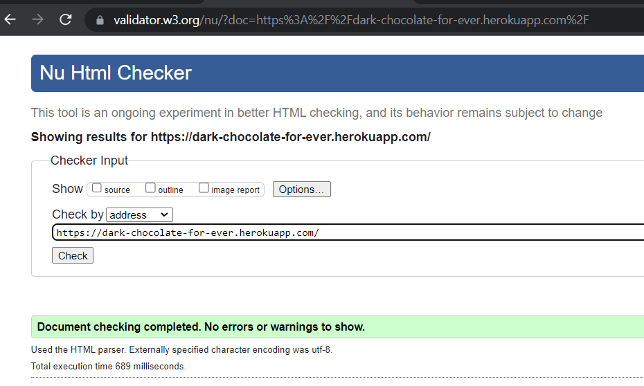
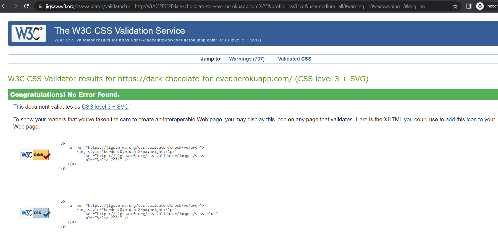
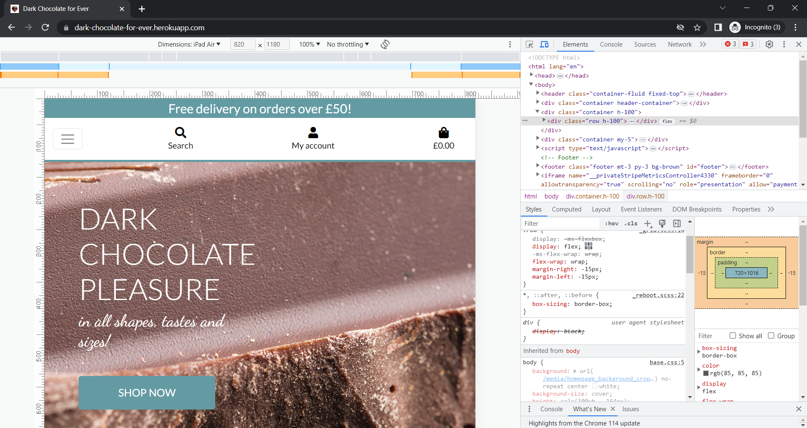

# TESTING

## Code Validation
The below online validation tools were used to validate the project pages to ensure that there were no syntax errors in the project.

### HTML Validator
See the screenshot below for HTML code test results run with [HTML Validator.](https://validator.w3.org/) No errors detected.

### CSS Validator
See the screenshot below for CSS code test results run with [CSS Validator.](https://jigsaw.w3.org/css-validator/) No errors detected.

### JavaScript Validator
See the screenshot below for JavaScript code test results run with [JavaScript Validator.](https://jshint.com/)

### Python Linter
Majority of errors discovered removed when coding and before running the Python Linter test already in the Gitpod workspace.
The following pages have been tested (under bilingualmama, bmblog and queries): admin.py, apps.py, forms.py, models.py, urls.py, views.py, models.py and settings.py on [Python Linter.](https://pep8ci.herokuapp.com/)

Some errors in settings.py indicated too long lines, but these errors were left without correction due to functionality not being affected in any way, as well as errors in other files mainly indicating white trailing spaces or missing white spaces around operators, keywords etc. 

---

## Lighthouse Test

See the screenshot below for the Lighthouse test results run with [Lighthouse Chrome Extension.](https://chrome.google.com/webstore/detail/lighthouse/blipmdconlkpinefehnmjammfjpmpbjk) When tested for Performance, Accessibility, Best Practices and SEO, good results were achieved.

---

## Responsiveness Test

Responsiveness was regularly checked throughout the development process on my desktop, but also on my Samsung Galaxy A12. Final responsiveness tests of the deployed up was don on Developer Tools in the views for Samsung Galaxy S8 (360 x 740 px) and iPad Air (820 x 1180 px). No issues detected. See the screenshots attached below.

---

## Browser Compatibility Test

Browser Compatibility was tested by using Chrome, Firefox and Microsoft Edge browsers. No issues were detected. As I don’t own any iOs devices, Safari browser was not tested.

---

## Features Test
TO BE ADDED

