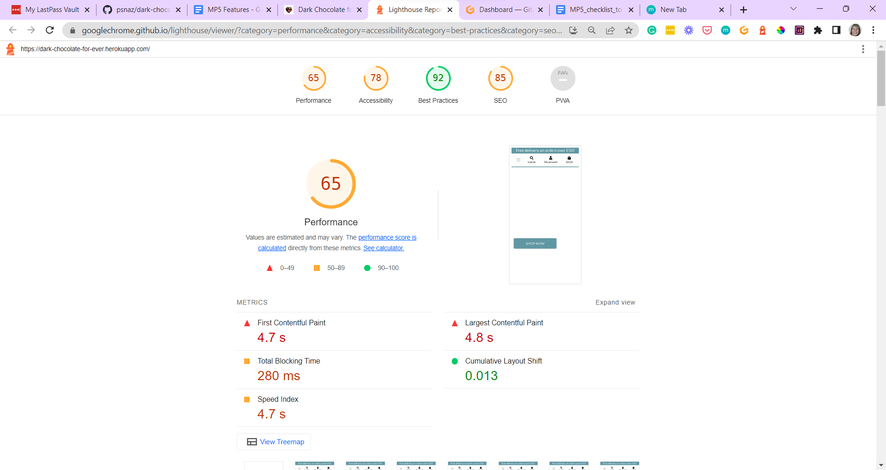

# TESTING

## Code Validation
The below online validation tools were used to validate the project pages to ensure that there were no syntax errors in the project.

### HTML Validator
See the screenshot below for HTML code test results run with [HTML Validator.](https://validator.w3.org/) No errors detected.

### CSS Validator

See the screenshot below for CSS code test results run with [CSS Validator.](https://jigsaw.w3.org/css-validator/) No errors detected.

### JavaScript Validator

See the screenshot below for JavaScript code test results run with [JavaScript Validator.](https://jshint.com/)

### Python Linter

Majority of errors discovered removed when coding and before running the Python Linter test already in the Gitpod workspace.
The following pages have been tested on [Python Linter.](https://pep8ci.herokuapp.com/):

**Bag** (app)

Templatetags >
-bagtools.py - no errors found

- admin.py - no errors found
- apps.py - no errors found
- contexts.py - no errors found
- models.py - no errors found
- urls.py - no errors found
- views.py - no errors found

**Checkout** (app)
- admin.py - no errors found
- apps.py - no errors found
- forms.py - no errors found
- models.py - 1 error found: 119: E501 line too long (95>79 characters)
- signals.py - no errors found
- urls.py - no errors found
- views.py - no errors found
- webhook-handler.py - no errors found
- webhooks.py

**Contact** app
- admin.py - no errors found
- apps.py - no errors found
- forms.py - no errors found
- models.py - no errors found
- urls.py - no errors found
- views.py - no errors found

**Dark_chocolate_for_ever** app
- asgi.py - no errors found
- settings.py - 147: E501 line too long (91>79 characters),  145: E501 line too long (81>79 characters),  153: E501 line too long (82>79 characters),  156: E501 line too long (83>79 characters)
- urls.py - no errors found
- views.py - no errors found
- wsgi.py - 14: E501 line too long (83>79 characters)

**Home** app
- admin.py - no errors found
- apps.py - no errors found
- models.py - no errors found
- urls.py - no errors found
- views.py - no errors found

 **Newsletter** app
- admin.py - no errors found
- apps.py - no errors found
- contexts.py - no errors found
- forms.py - no errors found
- models.py - no errors found
- urls.py - no errors found
- views.py - no errors found

**Products** app

- admin.py - no errors found
- apps.py - no errors found
- models.py - no errors found
- urls.py - no errors found
- views.py - 53: E501 line too long (80>79 characters)
- widgets.py - 9: E501 line too long (87>79 characters)

**Profiles** app
- admin.py - no errors found
- apps.py - no errors found
- forms.py - no errors found
- models.py - no errors found
- urls.py - no errors found
- views.py - no errors found

**Reviews** app
- admin.py - no errors found
- apps.py - no errors found
- forms.py - no errors found
- models.py - no errors found
- urls.py - no errors found
- views.py - no errors found

- manage.py - no errors found

---

## Lighthouse and GT Metrix Test

See the screenshot below for the Lighthouse test results run with [Lighthouse Chrome Extension.](https://chrome.google.com/webstore/detail/lighthouse/blipmdconlkpinefehnmjammfjpmpbjk) When tested for Performance, Accessibility, Best Practices and SEO, average results were achieved.

Additional tests carried out on [GT Metrix](https://gtmetrix.com/) (Website Performance Testing and Monitoring Online Tool). GT Metrix scanned all website pages during tests carried out from London based server. Although GT Metrix uses Lighthouse, the test results achieved were much better - please see the reports attached:

- [Desktop results](./docs/gtmetrix-report-desktop.pdf)
- [Mobile device results](./docs/gtmetrix-report-mobile.pdf)

---

## Responsiveness Test

Responsiveness was regularly checked throughout the development process on my desktop, but also on my Samsung Galaxy A12. Final responsiveness tests of the deployed up was don on Developer Tools in the views for Samsung Galaxy S8 (360 x 740 px) and iPad Air (820 x 1180 px). No issues detected. See the screenshots attached below.

Additional [Mobile Friendly Test](https://search.google.com/test/mobile-friendly) carried out online, view the results available online [here](https://search.google.com/test/mobile-friendly/result?id=MjCtJCfFnG2Op2TsBbPqqA) or see the screenshot below:

---

## Browser Compatibility Test

Browser Compatibility was tested by using Chrome, Firefox and Microsoft Edge browsers. No issues were detected. As I don’t own any iOs devices, Safari browser was not tested.

---

## Features Test

All features have been tested manually by clicking on the relevant links. 

---

## User Stories Test

All User Stories have been tested manually to make sure that all the Features are working properly. See the table below:

| ID |                As a/ an               |                         I want to be able to...                        |                                                   so that I can...                                                  |                                              Feature                                             |      Sprint      | Satisfied |
|:--:|:-------------------------------------:|:----------------------------------------------------------------------:|:-------------------------------------------------------------------------------------------------------------------:|:------------------------------------------------------------------------------------------------:|:----------------:|:---------:|
|    |         Viewing and Navigation        |                                                                        |                                                                                                                     |                                                                                                  |                  |           |
| 1  | Shopper                               | view a list of products                                                |  select some to purchase                                                                                            | Navbar/ Hamburger menu                                                                           | Basic Setup      | Yes       |
| 2  | Shopper                               | view a specific category of products                                   | quickly find products I’m interested in without having to search through all products                               | Dropdown menus                                                                                   | Basic Setup      |    Yes    |
| 3  | Shopper                               | view individual product details                                        | identify the price, description, product rating, product image and product size/ weight                             | Product details page                                                                             | Basic Setup      |    Yes    |
| 4  | Shopper                               | identify deals, clearance items and special offers                     | take advantage of special savings on products I'd like to purchase                                                  | currently not implemented due to small range of products                                         | Basic Setup      |     No    |
| 5  | Shopper                               | easily view the total of my purchases at any time                      |  avoid spending too much                                                                                            | Bag page                                                                                         | Payments         |    Yes    |
|    | Registration and User Accounts        |                                                                        |                                                                                                                     |                                                                                                  |                  |           |
| 6  | Site User                             | easily register for an account                                         | have a personal account and be able to view my profile                                                              |                                         Registration page                                        |    Basic Setup   |    Yes    |
| 7  | Site User                             | easily login and logout                                                |  access my personal account information                                                                             |                                        Login/Log out Pages                                       |    Basic Setup   |    Yes    |
| 8  | Site User                             | easily recover my password in case I forget it                         | recover access to my account                                                                                        |                                                                                                  |    Basic Setup   |    Yes    |
| 9  | Site User                             | receive an email confirmation after registering                        | verify that my account registration was successful                                                                  |                         Registration Success page and email confirmation                         |    Basic Setup   |    Yes    |
| 10 | Site User                             | have a personalized user profile                                       | view my personal order history and order confirmations, and save my payment information                             |                                           Account login                                          |    Basic Setup   |    Yes    |
|    | Sorting and Searching                 |                                                                        |                                                                                                                     |                                                                                                  |                  |           |
| 11 | Shopper                               | sort the list of available products                                    | easily identify the best rated, best priced and categorically sorted products                                       | Sort by dropdown menu on products page                                                           | Basic setup      |    Yes    |
| 12 | Shopper                               | sort a specific category of product                                    | find the best-priced or best-rated product in a specific category, or sort the products in that category by name    | Sort by dropdown menu on products page                                                           | Basic setup      |    Yes    |
| 13 | Shopper                               | sort multiple categories of products simultaneously                    | find the best-priced or best-rated products across broad categories, as as "chocolate bars" or "chocolate truffles" | Only chocolate bars currently available, no truffles are part of the product range               | Basic setup      | Partially |
| 14 | Shopper                               | search for a product by name or description                            | find a specific product I'd like to purchase                                                                        | Product and product details page, search bar                                                     | Basic setup      |    Yes    |
| 15 | Shopper                               | easily see what I've searched for and the number of results            | quickly decide whether the product I want is available                                                              | Search bar                                                                                       | Basic setup      |    Yes    |
|    | Purchasing and Checkout               |                                                                        |                                                                                                                     |                                                                                                  |                  |           |
| 16 | Shopper                               | easily select the quantity of a product when purchasing it             | ensure that I don't accidentally select the wrong product and quantity                                              |                      Quantity selector on product details page and bag page                      |     Payments     |    Yes    |
| 17 | Shopper                               | view items in my bag                                                   | identify the total cost of my purchase and all items I will receive                                                 |                     bag page and success alert when product added to the page                    |     Payments     |    Yes    |
| 18 | Shopper                               | adjust the quantity of individual items in my bag                      | easily make changes to my purchase before checkout                                                                  |                                             bag page                                             |     Payments     |    Yes    |
| 19 | Shopper                               | easily enter my payment information                                    | check out quickly and with no hassles                                                                               |                                           checkout page                                          |     Payments     |    Yes    |
| 20 | Shopper                               | feel my personal and payment information is safe and secure            | confidently provide the needed information to make a purchase                                                       |                                    acc registration and login                                    |     Payments     |    Yes    |
| 21 | Shopper                               | view an order confirmation after check out                             | verify that I haven’t made any mistakes                                                                             |                                           order summary                                          |     Payments     |    Yes    |
| 22 | Shopper                               | receive an email confirmation after checking out                       | keep the confirmation of what I’ve purchased for my records                                                         |                                        email confirmation                                        |     Payments     |    Yes    |
|    | Admin and Store Management            |                                                                        |                                                                                                                     |                                                                                                  |                  |           |
| 23 | Store Owner                           | add a product                                                          | add new items to my store                                                                                           |                                        front end/ backend                                        | Store Management |    Yes    |
| 24 | Store Owner                           | edit/ update a product                                                 | change product prices, descriptions, images, and other product criteria                                             |                                        front end/ backend                                        | Store Management |    Yes    |
| 25 | Store Owner                           | delete a product so that I can remove items that are no longer on sale | delete a product so that I can remove items that are no longer on sale                                              |                                        front end/ backend                                        | Store Management |    Yes    |
|    | Rating and Reviewing Product          |                                                                        |                                                                                                                     |                                                                                                  |                  |           |
| 26 | Customer                              | click on a product I previously purchased                              | give it a rating                                                                                                    |     All logged in users can currently rate a product regardless if they previously purchased     |     Marketing    | Partially |
| 27 | Customer                              | click on a product I previously purchased                              | write a review about it                                                                                             |    All logged in users can currently review a product regardless if they previously purchased    |     Marketing    |    Yes    |
|    | Getting in Touch and Staying in Touch |                                                                        |                                                                                                                     |                                                                                                  |                  |           |
| 28 | Shopper                               | subscribe to a newsletter                                              | stay updated on the latest product news and discounts                                                               |                            newsletter subscription form in the footer                            |     Marketing    |    Yes    |
| 29 | Shopper                               | contact the Seller via their Contact form                              |  ask any question I may have                                                                                        | contact page available in the home dropdown in the navbar or under the quick links in the footer |      Contact     |    Yes    |

---

### Stripe Test

The payment system test of Stripe implementation working properly has been tested manually.

---

